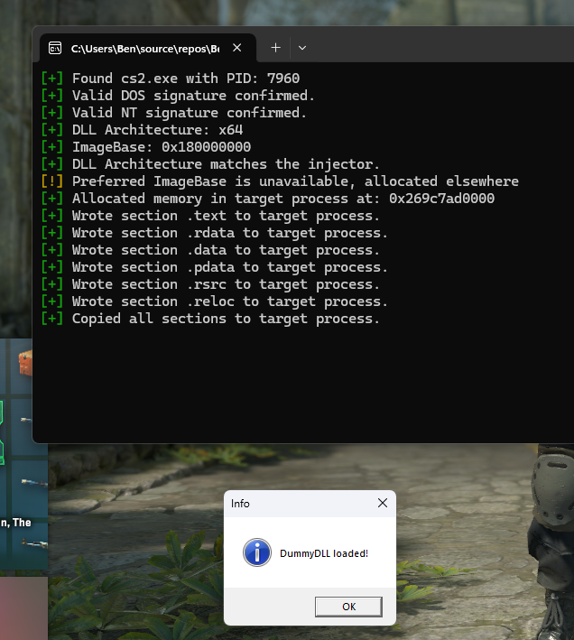

# <h1 align="center">ManualMapper</h1>

<p align="center">A basic injection technique using manual mapping.</p>

<p align="center">
	
	<a href="https://github.com/BenMcAvoy/ManualMapper/stargazers"></a>
	<a href="https://github.com/BenMcAvoy/ManualMapper/issues"></a>
	<a href="https://github.com/BenMcAvoy/ManualMapper/blob/main/LICENSE"></a>
</p>

<p align="center">
	
</p>

## Features:
- [x] DLL mapping
- [x] Dependency loading
- [x] TLS callbacks
- [x] Shellcode based loading
- [ ] Handless approach
- [ ] Thread hijacking

## CLI arguments

`ManualMapper` accepts a few command line flags to control the injection target and DLL path. The flags are implemented in `main.cpp` using `args.hxx` and are:

- `-p`, `--process` (or `process`) — Name of the target process to inject into. Default: `DummyApp.exe`.
- `-d`, `--dll` (or `dll`) — Path to the DLL to inject. Default: `DummyDLL.dll`.
- `-t`, `--targetdir` (or `targetdir`) — If present, the injector will change the working directory to the build output folder for the current injector configuration (e.g. `..\x64\Debug\` or `..\x64\Release\`). This makes it easier to run the injector from the repo root and target the built `DummyDLL`. This is mostly useful for developing the mapper.
- `-h`, `--help` — Show the help message and exit.

Examples:

- Inject `DummyDLL.dll` into `DummyApp.exe` (defaults):

```
ManualMapper.exe
```

- Inject a different DLL into a running process:

```
ManualMapper.exe -p MyTarget.exe -d C:\path\to\MyDLL.dll
```

- Use `--targetdir` to automatically switch into the build output folder (helpful when running from the solution root):

```
ManualMapper.exe -t
```

If the target process cannot be found, the injector will log an error and exit. If the injector and DLL architectures (x86 vs x64) mismatch, mapping will fail.

## How it works

This project demonstrates a simple manual-mapping injector. In short, the injector:

- Reads the DLL file from disk and validates the PE headers (DOS/NT signatures and optional header/architecture).
- Attempts to allocate the module's preferred ImageBase in the target process with `VirtualAllocEx`; if that fails it allocates memory anywhere.
- Copies each PE section into the remote process using `WriteProcessMemory`.
- Writes a small `ManualMappingData` structure into the mapped image (this holds pointers to `LoadLibraryA`, `GetProcAddress` and a placeholder `hinstDLL`).
- Allocates space for a small shellcode stub in the remote process, writes the shellcode there, and starts it via `CreateRemoteThread` (the shellcode receives a pointer to the mapped image/base data).
- The shellcode performs base relocations if the module was rebased. The source contains commented code that shows how import resolution, TLS callback invocation, and calling the DLL's entry point (DllMain) would be performed inside the shellcode.
- The injector waits and reads back the `hinstDLL` value from the target process to determine when mapping is complete.

Notes / caveats:
- The injector enforces a matching architecture (x86 vs x64) between injector and DLL.
- The shellcode performs base relocations, resolves imports, invokes TLS callbacks and calls the DLL entry point (DllMain) If any import resolution or TLS callbacks fail the mapping will abort.
- Manual mapping modifies the in-memory image directly and can be detected by security products. This code is intended for educational and testing purposes only.

Usage in this repo: `main.cpp` looks for `DummyApp.exe`, opens the target process, and maps `DummyDLL.dll` from the build folder (`..\x64\Debug` or `..\x64\Release` depending on the injector build configuration).

> [!IMPORTANT]  
> Running the mapper or the injected DLL in Debug mode commonly causes crashes (debug CRTs, extra runtime checks) You should only use Debug mode if you know what you are doing